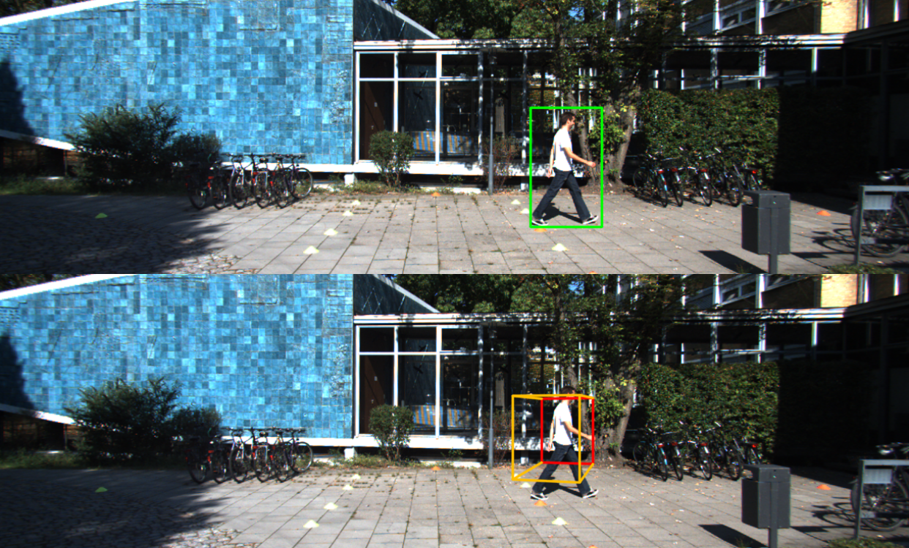
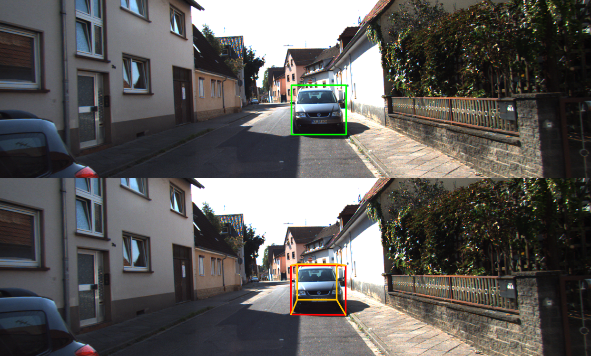
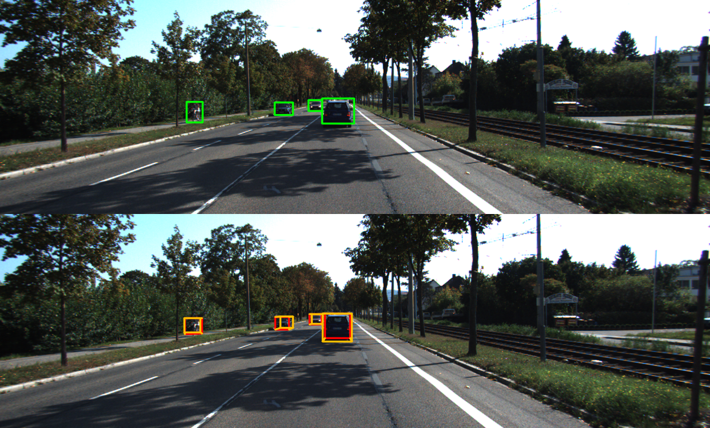
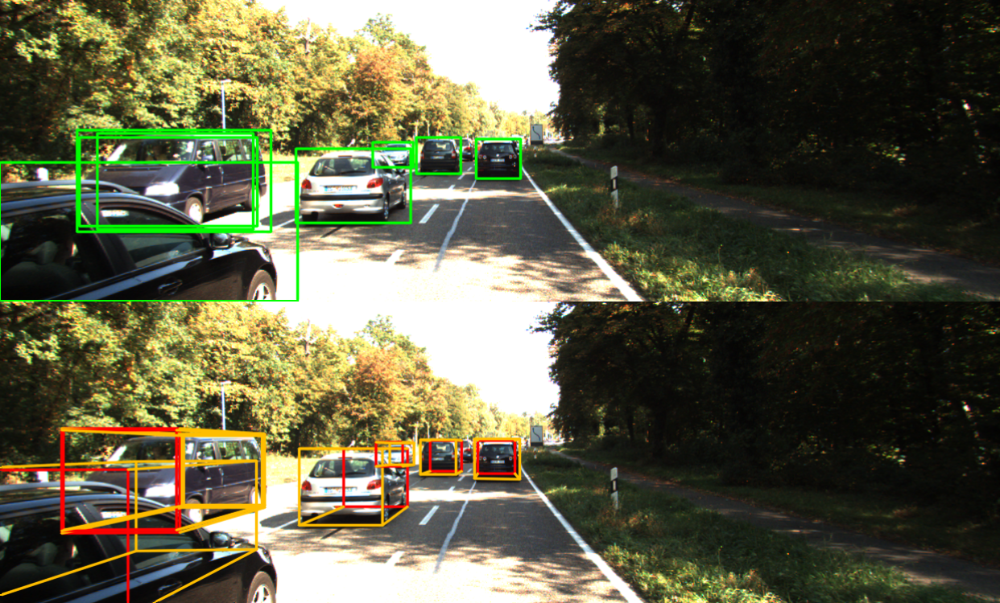
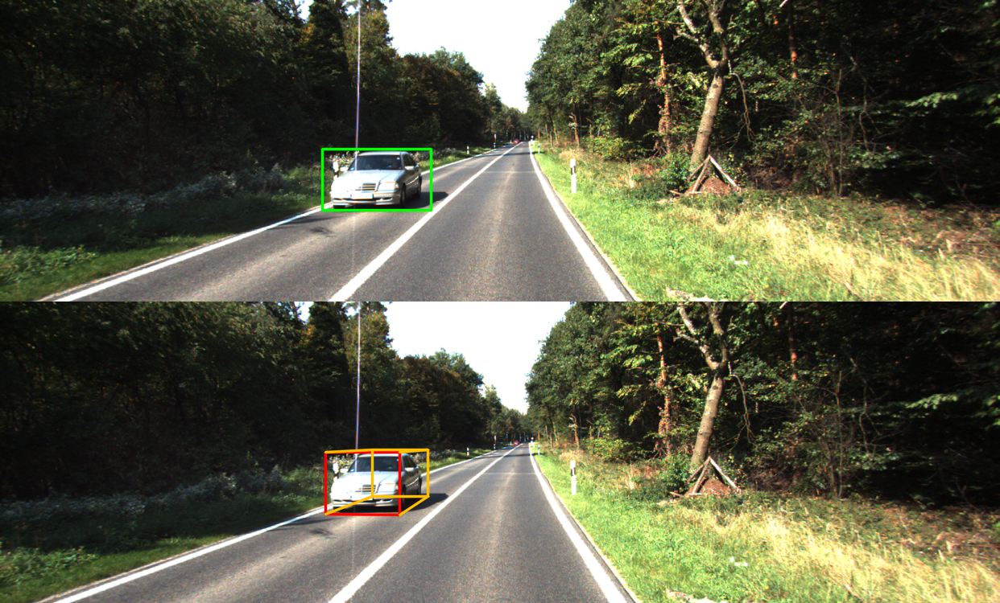
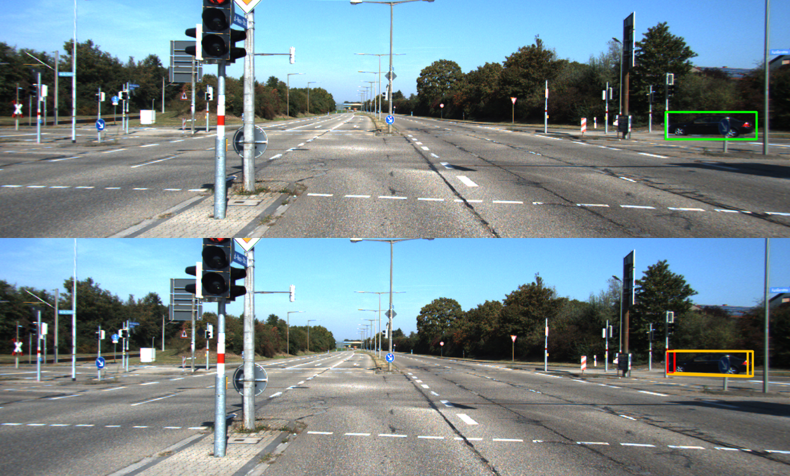

# 3D-Object-Detection-For-Autonomous-Driving
In this work, we address the problem of 3D object detection from point cloud data in real time. For autonomous vehicles to work, it is very important for the perception component to detect the real world objects with both high accuracy and fast inference. 
# TASK
With the rapid evolution in the world of technology, it becomes increasingly important for the automotive sector to keep up with the fast pace, just like any other industry. In recent times, self-driving cars have gained a lot of traction but there is a huge gap in expectation and the current state. Self Driving Vehicles are one of the most hyped technologies of the modern decade. Even though many companies may brand their driver assistance technology as “Autopilot” a truly self-driving vehicle, without a human driver on open roads, has not yet become a reality.
# DATASET
The dataset can be downloaded from https://drive.google.com/file/d/1xTbwVPfQ9zlYr2sd6h83498sAuFYY1zB/view?usp=sharing.

Dataset includes:

- Velodyne point clouds 
- Training labels of object data set
- camera calibration matrices of object data set
- Left color images of object data set 
# 2D-DETECTION
The goal of the first part of this project is to detect objects from a number of object classes in realistic scenes for the KITTI 2D dataset then we take these detections from a 2D object detector as input 2Dbboxes for a 3D object detection.
Pre-trained weights can be obtained at https://drive.google.com/open?id=1qvv5j59Vx3rg9GZCYW1WwlvQxWg4aPlL
# 3D-DETECTION
This work constitutes roughly 50% of the MSc thesis:
- Automotive 3D Object Detection Without Target Domain Annotations [PDF](http://liu.diva-portal.org/smash/record.jsf?pid=diva2%3A1218149&dswid=-2619) [slides](http://www.fregu856.com/static/msc_thesis_slides.pdf)
- Fredrik K. Gustafsson and Erik Linder-Norén
- Master of Science Thesis in Electrical Engineering, Linköping University, 2018
- 3DOD_thesis repo link : [ 3DOD_thesis ](https://github.com/fregu856/3DOD_thesis#visualization)
# Run pretrained Image-Only model on KITTI val:
- Image-Only is a model constructed with pretrained Resnet34 
- Running the inference Notebook will create the file 3DOD_thesis/training_logs/model_Image-Only_eval_test/eval_dict_test.pkl, containing predicted 3Dbbox parameters which can be used for visualization.
- Pre-trained weights are located in 3DOD_thesis/Image-Only/eval_imgnet_test.py
# Results:
Feel free to put your own test images here. The results are saved in /final directory. Some inference results are shown below.
******

# References:
- https://github.com/eriklindernoren/PyTorch-YOLOv3
- https://github.com/ssaru/convert2Yolo
- https://github.com/BobLiu20/YOLOv3_PyTorch
- https://github.com/packyan/PyTorch-YOLOv3-kitti
- https://github.com/fregu856/3DOD_thesis

